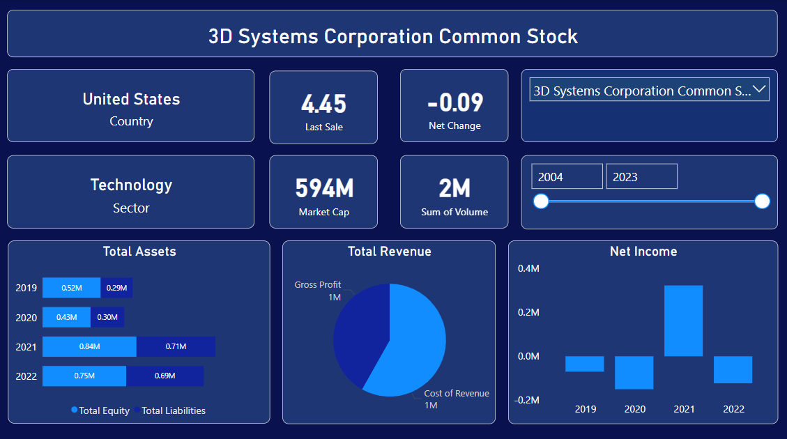

# StockViz: Nasdaq Financials Scraper & Dashboard

**StockViz** is a powerful tool designed for financial enthusiasts and analysts, enabling seamless extraction and visualization of financial data from Nasdaq. Utilizing **Scrapy** for efficient data scraping, StockViz gathers crucial stock information and transforms it into insightful visual dashboards using **Power BI**.

## Key Features
- **Automated Data Extraction:** Scrapes real-time financial details of companies listed on Nasdaq with ease.
- **Dynamic Dashboards:** Leverages Power BI to create interactive visualizations for comprehensive data analysis.
- **User-Friendly Interface:** Simplifies complex data sets into accessible insights for informed decision-making.
- **Customizable Insights:** Allows users to tailor visualizations based on their specific analytical needs.

## Use Cases
- Analyze stock performance trends.
- Compare financial metrics across different companies.
- Monitor market fluctuations and derive actionable insights.

## Dashboard Preview

### Desktop View


Explore the interactive Power BI dashboard below:


### Prerequisites
- Python 3.x
- Scrapy
- Power BI

### Installation
1. Clone the repository:
   ```bash
   git clone https://github.com/YasoobRaza/StockViz.git
   ```
2. Navigate to the project directory:
   ```bash
   cd StockViz
   ```
3. Install required Python packages:
   ```bash
   pip install -r requirements.txt
   ```

### Running the Scraper
1. Execute the Scrapy spider:
   ```bash
   scrapy crawl financials_spider
   ```

2. After scraping, import the data into Power BI for visualization.

## Contributing
Contributions are welcome! If you have suggestions for improvements or features, please open an issue or submit a pull request.

## License
This project is licensed under the MIT License - see the [LICENSE](LICENSE) file for details.

## Acknowledgements
- [Scrapy](https://scrapy.org/)
- [Power BI](https://powerbi.microsoft.com/)
- [GitHub](https://github.com/)
